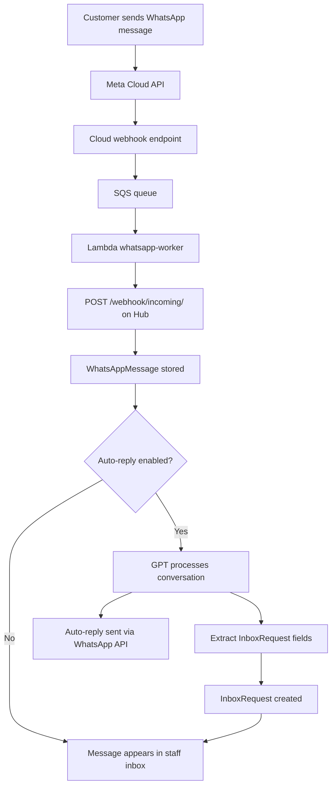

# WhatsApp Inbox (module: `whatsapp_inbox`)

Receive and process WhatsApp Business messages with AI-powered auto-reply and request management.

## Purpose

The WhatsApp Inbox module connects the hub to WhatsApp Business via the Meta Cloud API. Incoming messages from customers are received through a Meta webhook (verified by HMAC signature), optionally processed by an AI auto-reply (GPT, configured per hub), and surfaced in a staff inbox for review and follow-up.

The module operates in two account modes: `shared` (one business number for the whole hub) or `per_employee` (each staff member has their own WhatsApp linked). Incoming messages are organized into conversations per contact. Staff can reply directly from the inbox. A configurable `request_schema` (JSONB) defines the dynamic fields that the AI extracts from conversations to create structured `InboxRequest` records — for example, extracting appointment date/time/service from a booking message.

Message routing is driven by Cloud infrastructure: Meta sends webhooks to Cloud, Cloud validates and forwards via SQS + Lambda worker, which calls the Hub's webhook endpoint at `POST /api/v1/m/whatsapp_inbox/webhook/incoming/`.

## Models

- `WhatsAppInboxSettings` — Singleton per hub. is_enabled, account_mode (shared/per_employee), auto_reply_enabled, approval_mode (auto/manual), require_confirmation, request_schema (JSONB), gpt_system_prompt, input_modules, output_modules, auto_close_hours, notify_staff_new_request, greeting/out-of-hours messages.
- `EmployeeWhatsAppLink` — Maps an employee to their personal WhatsApp number (per-employee mode only).
- `WhatsAppConversation` — Conversation thread with a WhatsApp contact: contact phone, contact name, status (open/closed/pending), last message timestamp, assigned staff.
- `WhatsAppMessage` — Individual message in a conversation: direction (inbound/outbound), body, media type, media URL, timestamp, status (sent/delivered/read/failed).
- `InboxRequest` — Structured request extracted from a conversation by the AI: dynamic fields per `request_schema`, status (pending/confirmed/rejected/completed), linked conversation.

## Routes

`GET /m/whatsapp_inbox/inbox` — Conversation inbox
`GET /m/whatsapp_inbox/requests` — Structured request list
`GET /m/whatsapp_inbox/templates` — Message template management
`GET /m/whatsapp_inbox/settings` — Connection and configuration settings

## API

`GET /api/v1/m/whatsapp_inbox/webhooks/meta/{account_id}` — Meta webhook verification challenge (GET)
`POST /api/v1/m/whatsapp_inbox/webhooks/meta/{account_id}` — Meta Cloud API incoming messages
`POST /api/v1/m/whatsapp_inbox/webhook/incoming/` — Lambda whatsapp-worker delivers processed messages here

## Flow

## Dependencies

- `customers`

## Pricing

Free.
