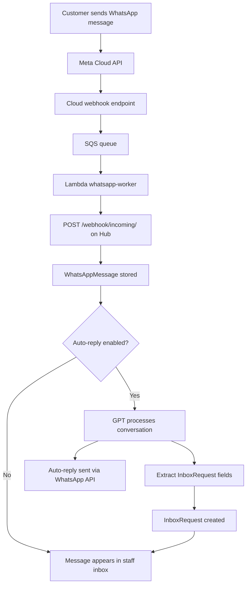

# WhatsApp Inbox (módulo: `whatsapp_inbox`)

Recepción y procesamiento de mensajes de WhatsApp Business con respuesta automática por IA y gestión de solicitudes.

## Propósito

El módulo WhatsApp Inbox conecta el hub a WhatsApp Business a través de la Meta Cloud API. Los mensajes entrantes de clientes se reciben a través de un webhook de Meta (verificado por firma HMAC), se procesan opcionalmente mediante respuesta automática por IA (GPT, configurado por hub) y se presentan en una bandeja de entrada del personal para revisión y seguimiento.

El módulo opera en dos modos de cuenta: `shared` (un número de empresa para todo el hub) o `per_employee` (cada miembro del personal tiene su propio WhatsApp vinculado). Los mensajes entrantes se organizan en conversaciones por contacto. El personal puede responder directamente desde la bandeja de entrada. Un `request_schema` configurable (JSONB) define los campos dinámicos que la IA extrae de las conversaciones para crear registros `InboxRequest` estructurados — por ejemplo, extrayendo fecha/hora/servicio de una cita a partir de un mensaje de reserva.

El enrutamiento de mensajes lo gestiona la infraestructura Cloud: Meta envía webhooks a Cloud, Cloud valida y reenvía mediante SQS + Lambda worker, que llama al endpoint de webhook del Hub en `POST /api/v1/m/whatsapp_inbox/webhook/incoming/`.

## Modelos

- `WhatsAppInboxSettings` — Singleton por hub. is_enabled, account_mode (shared/per_employee), auto_reply_enabled, approval_mode (auto/manual), require_confirmation, request_schema (JSONB), gpt_system_prompt, input_modules, output_modules, auto_close_hours, notify_staff_new_request, mensajes de bienvenida/fuera de horario.
- `EmployeeWhatsAppLink` — Vincula un empleado a su número personal de WhatsApp (solo en modo per_employee).
- `WhatsAppConversation` — Hilo de conversación con un contacto de WhatsApp: teléfono del contacto, nombre del contacto, estado (open/closed/pending), timestamp del último mensaje, personal asignado.
- `WhatsAppMessage` — Mensaje individual en una conversación: dirección (inbound/outbound), cuerpo, tipo de medio, URL del medio, timestamp, estado (sent/delivered/read/failed).
- `InboxRequest` — Solicitud estructurada extraída de una conversación por la IA: campos dinámicos según `request_schema`, estado (pending/confirmed/rejected/completed), conversación vinculada.

## Rutas

`GET /m/whatsapp_inbox/inbox` — Bandeja de entrada de conversaciones
`GET /m/whatsapp_inbox/requests` — Lista de solicitudes estructuradas
`GET /m/whatsapp_inbox/templates` — Gestión de plantillas de mensajes
`GET /m/whatsapp_inbox/settings` — Configuración de conexión y ajustes

## API

`GET /api/v1/m/whatsapp_inbox/webhooks/meta/{account_id}` — Verificación del webhook de Meta (GET)
`POST /api/v1/m/whatsapp_inbox/webhooks/meta/{account_id}` — Mensajes entrantes de la Meta Cloud API
`POST /api/v1/m/whatsapp_inbox/webhook/incoming/` — El Lambda whatsapp-worker entrega aquí los mensajes procesados

## Flujo

## Dependencias

- `customers`

## Precio

Gratuito.
